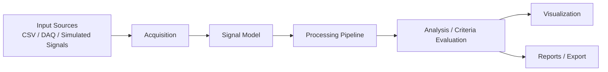

# FerrisOxide System Overview

Date: 2026-06-06

## Purpose

This document owns the top-level FerrisOxide system flowchart. It is intentionally high-level and does not show internal crate details. Crate-local diagrams belong in `crates/<crate-name>/architecture.md`.

Current implemented source support is local CSV and fixture-backed simulation. Live DAQ remains separately gated, so DAQ appears here only as a future input-source category.

## System Flow

## Stage Boundaries

| Stage | Responsibility | Current scope notes |
|---|---|---|
| Input Sources | External or generated signal data that enters FerrisOxide. | CSV and fixture simulation are implemented; live DAQ is gated. |
| Acquisition | Source parsing, fixture intake, and future acquisition adapters. | Must not imply vendor SDK or live hardware support without a new gate. |
| Signal Model | Time axis, channel samples, units, metadata, and derived lineage. | Raw input data must remain distinguishable from derived artifacts. |
| Processing Pipeline | Ordered filters, transforms, feature extraction, and conditioning. | Transform assumptions, units, timing, and raw-data preservation must be documented. |
| Analysis / Criteria Evaluation | Measurement-backed pass/fail evaluation and evidence generation. | Criteria evidence must remain traceable to source or derived signals. |
| Visualization | SVG plots and optional native GUI plot review. | Visual evidence is software evidence, not hardware qualification. |
| Reports / Export | Text/JSON reports, evaluation bundles, and package/export artifacts. | Runtime loaders, releases, signing, and certification evidence remain separately gated. |

## Diagram Hierarchy

- This file owns the full-system flowchart.
- Crate-local `architecture.md` files must show only that crate's inputs, internal processing stages, outputs, public APIs, and important error paths.
- Crate-local diagrams must not duplicate the full-system flowchart.
- Update this file when the top-level FerrisOxide workflow changes.
- Update the relevant crate-local diagram when a crate responsibility, public API, or data flow changes.
